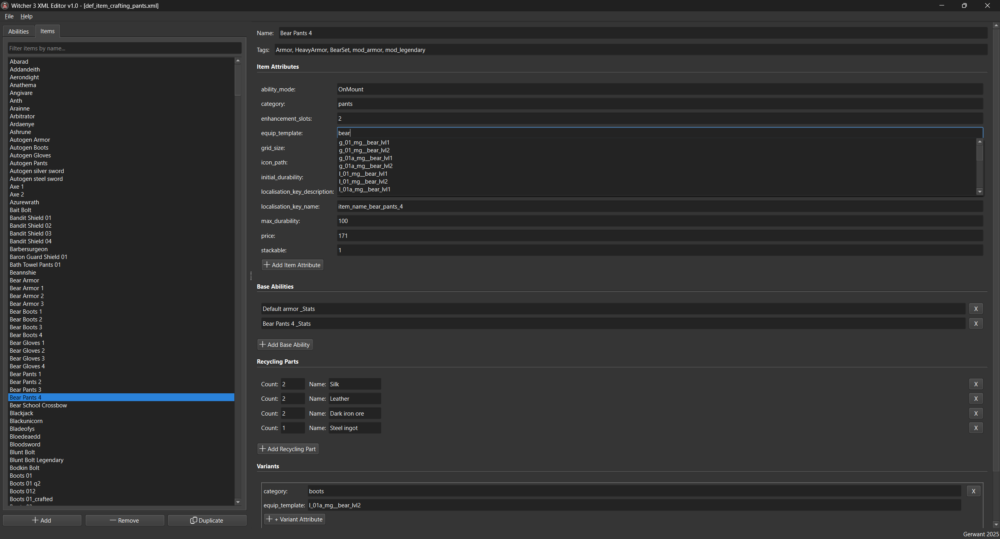

# Witcher 3 XML Editor

This program is a GUI editor for fast viewing and modifying XML files containing definitions for skills (abilities) and items from The Witcher 3: Wild Hunt.

---

## Key Features

*   **Folder Loading:** Ability to open an entire folder containing `.xml` files (e.g., from an unpacked mod or game files). The program automatically searches the folder and its subfolders.
*   **Data Browsing:**
    *   Displays discovered abilities and items in separate tabs within a list view on the left.
    *   Lists can be filtered by typing part of the name into the "Filter..." fields.
*   **Details Editing:**
    *   Selecting an entry from the list displays its details in the right-hand pane.
    *   **Item Attributes:** Edit all attributes of the main `<item>` element (e.g., `category`, `price`, `equip_template`, `icon_path`).
    *   **Item Structure:** Add, remove, and edit:
        *   Base Abilities references.
        *   Recycling Parts (part name and count).
        *   Variants (including their attributes and nested elements like `<item>` or `<ability>`).
    *   **Ability Properties:** For abilities, edit their properties (e.g., `duration`, `attack_power`), their attributes (e.g., `type`, `min`, `max`), and add new properties and attributes.
*   **Autocompletion:** While editing many fields (like attributes, tags, referenced item/ability names), the program suggests known values gathered from all loaded files. This helps prevent typos and discover available options.
*   **Entry Management:**
    *   **Add:** Create entirely new abilities or items (using the "Add" button). It will be added to the file of the currently selected entry or the first suitable file if nothing is selected.
    *   **Remove:** Permanently delete the selected ability or item from its XML file (using the "Remove" button).
    *   **Duplicate:** Create a copy of the selected entry under a new name (using the "Duplicate" button). Very useful for creating variations of existing items/abilities.
*   **Saving:**
    *   Tracks modified files (indicated by `(*)` or `(+)` in the window title).
    *   Save options: "Save" (saves the currently viewed file), "Save All" (saves all changed files), "Save As..." (saves the current file to a new name/location).
    *   Prompts to save changes when closing the application or opening a new folder if modifications exist.
*   **File Location:** Right-click an entry in the list and select "Open File Location" to reveal the containing XML file in your system's file explorer.
*   **Configuration:** Remembers the last successfully opened folder in an `editor_config.ini` file (in the same directory as the program) and attempts to reload it on the next launch.

---

## Requirements

*   Windows Operating System (for the executable version).
*   .NET Framework (if prompted by Windows, usually pre-installed).
*   The Witcher 3: Wild Hunt game files (or unpacked mod files) you wish to edit.

---

## How to Use (Basic Workflow)

1.  Launch the program (`WitcherXMLEditor.exe`).
2.  Use the **File -> Open Folder...** menu to select the folder containing the XML files you wish to edit.
    *   *(Note: I include unpacked base game .xml files in the program package. You can use them by pointing the editor to the `xml_uncooked` folder included with the editor.)*
3.  Select the **Abilities** or **Items** tab on the left.
4.  Use the **Filter...** box or scroll the list to find the entry you want to modify. Click on it.
5.  The details for the selected entry will appear in the right-hand pane.
6.  Edit the values in the text fields. Pay attention to the autocompletion suggestions.
7.  Use the `+ Attr`, `+ Property`, `Add Base Ability`, `Add Recycling Part`, `Add Variant`, `+ Nested Element`, etc., buttons within the relevant sections to add new structural elements.
8.  Use the small **"X"** buttons next to individual entries (like attributes, parts, variants) to remove them.
9.  To add, remove, or duplicate an entire ability/item entry, use the **Add**, **Remove**, **Duplicate** buttons below the lists on the left.
10. To see which file contains the currently edited entry, right-click it in the list and choose **Open File Location**.
11. When finished editing, save your changes using **File -> Save** (for the current file) or **File -> Save All** (for all modified files).
12. **Important:** After saving your changes in this editor, you need to create your mod package. Load the edited `.xml` file(s) into your preferred Witcher 3 modding tool (**REDkit** or **WolvenKit**) and follow the standard procedure to build and pack your mod. This editor only modifies the XML definitions; it does not create the final mod package.

## Author & Credits

*   Created by **Gerwant**.
*   Nexus Mods: [https://next.nexusmods.com/profile/gerwant30](https://next.nexusmods.com/profile/gerwant30)
*   YouTube: [https://www.youtube.com/@TalesoftheWitcher](https://www.youtube.com/@TalesoftheWitcher)

---
